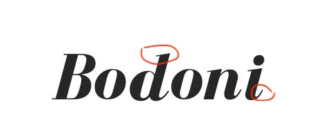
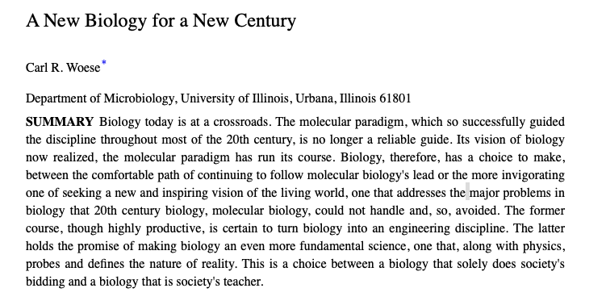

# 数字Font说

## 前言
前端开发经常需要处理字体相关的事情，简单的如更换字体，表现不同类型的文本；复杂的如自定义字体，为特殊的业务场景增加表现力。因为计算机发展自西方，所以很多和字体相关的概念也都跟西方的文字排版和计算机发展历史相关。

## 相关的概念

### Typeface
___Typeface___ 是数字字体里最小的概念，也是最好理解的概念。___Typeface___ 决定了文字展现的样式和特点(如文字的形状风格，字母的间距等)，它是最具象的概念。

___Typeface___ 主要分为4种。

* **衬线字体(Serif typeface)**

  衬线是指西方文字里字母书写起笔和收笔时，使用不同粗细的笔触添加的装饰。衬线字体最大的特点是字母不同部位粗细的不同，外加衬线的装饰作用。

  经典的衬线字体 ___Times New Roman___

  
  
  **Bodoni**是另外一种衬线字体

  

  拿西方的标准来区分，___宋体___ 就算是一种非常标准的衬线字体了，粗细有致，起落笔笔触突显明显。

  

  #### 衬线字体的应用

  衬线字体在应用上的特点文字易读性比较好，因此也主要使用在一些较为严肃的场合，如出版物和官方文件等。在西方世界使用频繁Roman字体，最早可追溯到西方几百年以前一个叫做Nicolas Jensen的人，Nicolas Jensen被认为设计了最早的Roman字体。

  

  A New Biology for a New Century

* **非衬线字体(Sans Serif Typeface)**
  hello world
